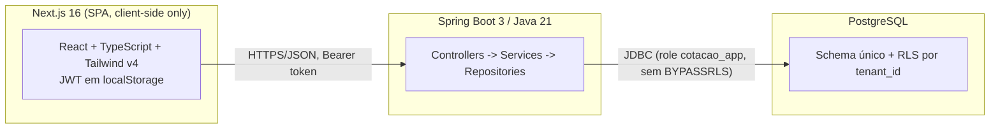
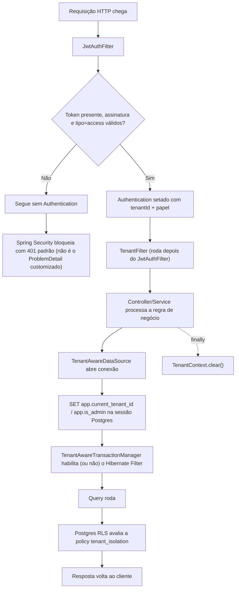
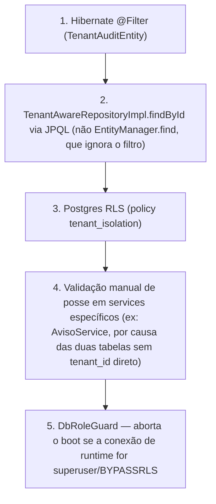

# Fluxograma 00 — Arquitetura Geral e Pipeline de Requisição

Visão geral da stack e do caminho que toda requisição autenticada percorre antes de
tocar o banco. Detalhe do multi-tenancy/RLS está no Fluxograma 02.

## Stack

## Pipeline de uma requisição autenticada

Ver Fluxograma 02 para o detalhe de cada uma dessas etapas (bypass de admin, filtro
Hibernate, policies de RLS por join-path).

## Camadas de defesa contra vazamento cross-tenant (resumo)

`cotacao_produto` e `cotacao_produto_fornecedor` não têm coluna `tenant_id` direta e
não estendem `TenantAuditEntity` — dependem só das camadas 3 e 4.
