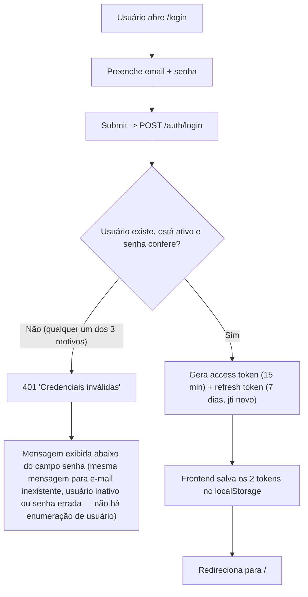
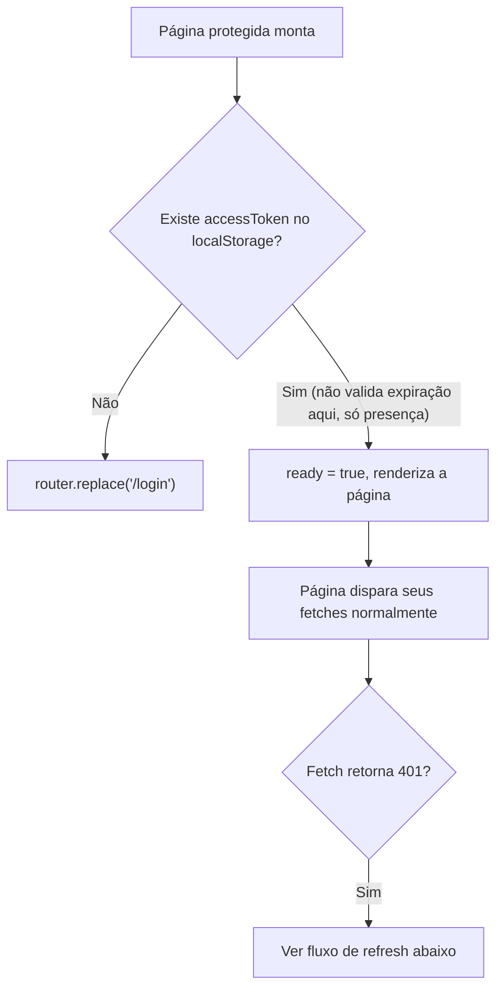
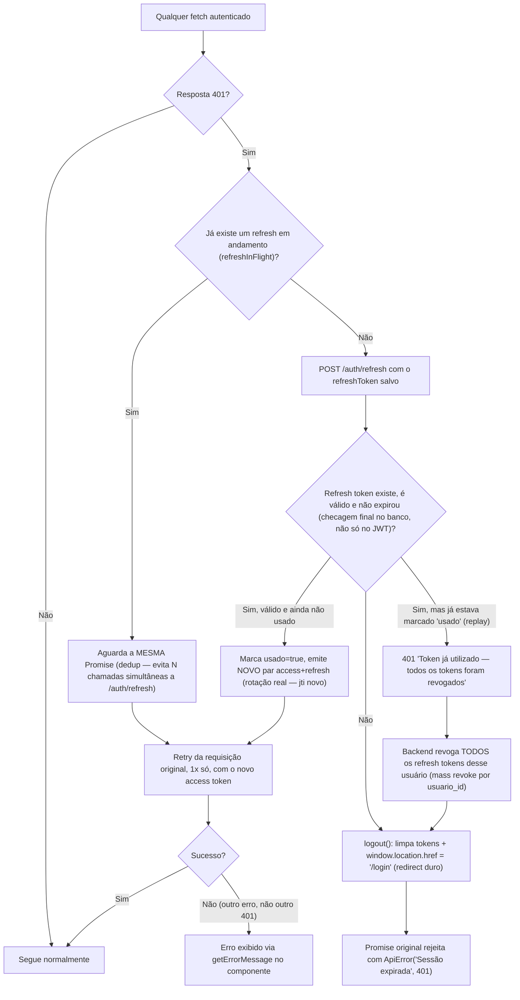
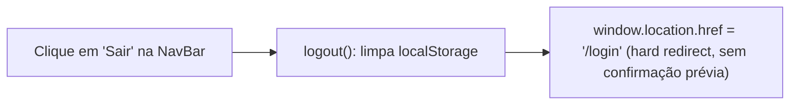

# Fluxograma 01 — Autenticação e Sessão

## Login

Não há rate limiting, captcha ou bloqueio por tentativas — login errado repetido
nunca é throttled hoje.

## AuthGuard (toda rota exceto /login)

## Requisição autenticada e renovação automática (401 → refresh → retry)

Ponto importante: como a revogação em massa acontece por `usuario_id`, um refresh
token roubado e reaproveitado (replay) derruba **todas** as sessões do usuário,
inclusive a legítima que já havia girado para um token novo.

## Logout

