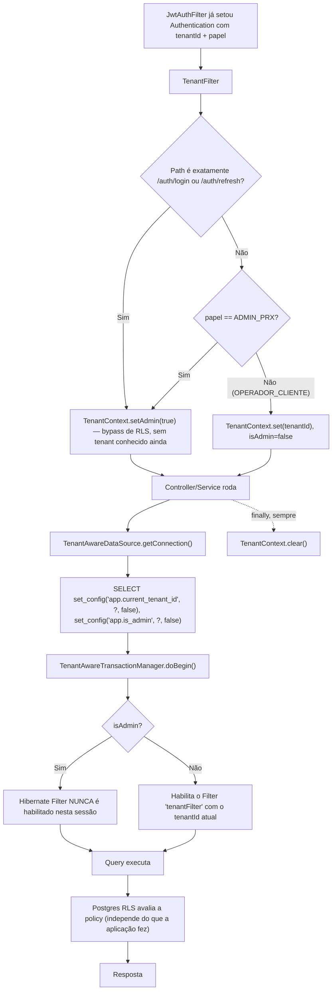
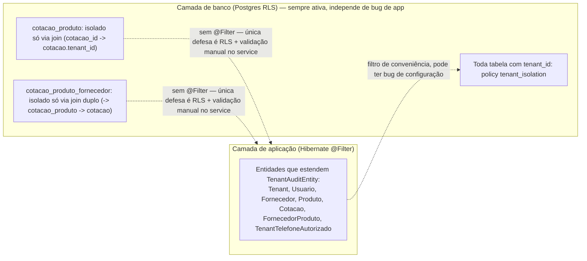
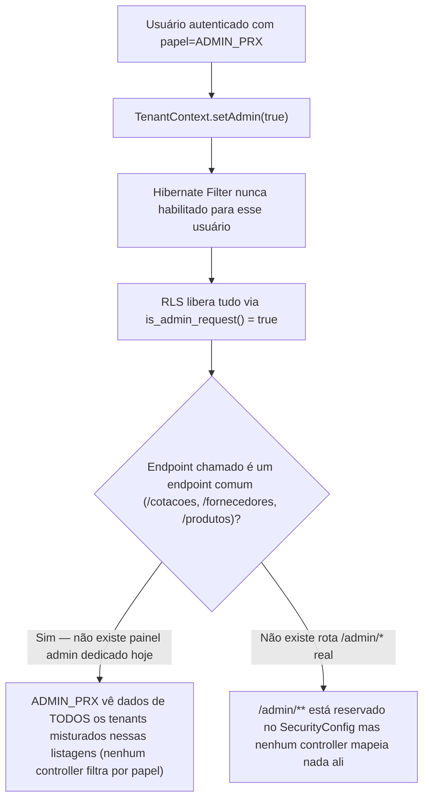
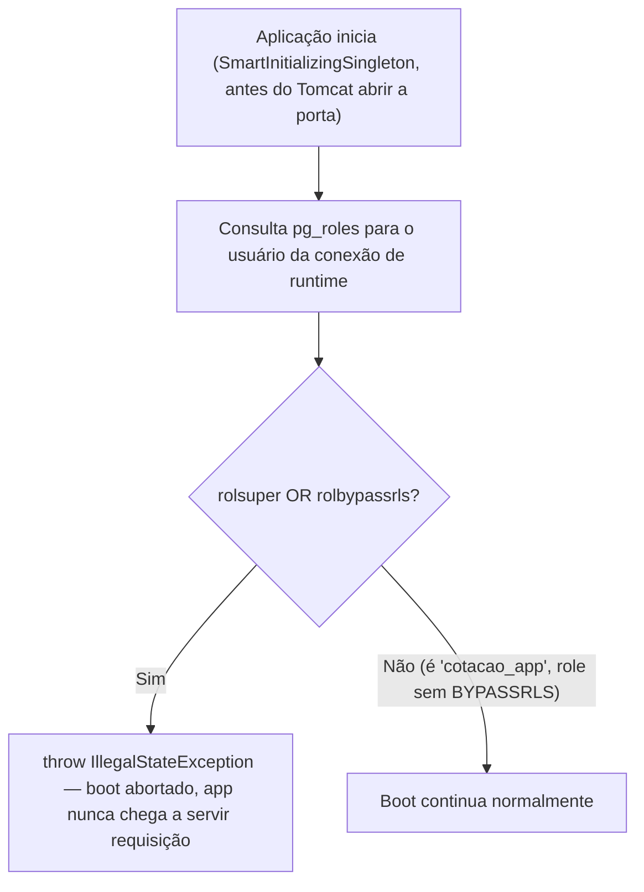

# Fluxograma 02 — Multi-tenancy e Row-Level Security

## Como o tenant é resolvido e propagado até o banco

## Duas camadas independentes — por que ambas existem

`cotacao_produto` e `cotacao_produto_fornecedor` são as duas entidades sem
`tenant_id` direto. Por isso `AvisoService.resolver()` faz uma validação manual extra
de posse (ver Fluxograma 05) — não dá pra confiar só no filtro Hibernate ali.

## Bypass de administrador (ADMIN_PRX)

## Boot-time safety net — DbRoleGuard

Existe porque, num incidente já registrado neste projeto, todo ambiente (incluindo
testes) conectava com o mesmo role usado pelas migrations — que no Postgres é
superuser por bootstrap, e superuser ignora RLS incondicionalmente. As migrations
(Flyway) continuam rodando com o role admin/superuser; só a conexão de runtime do
app é que precisa ser o role restrito.
