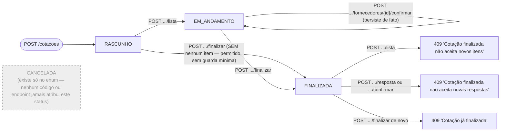
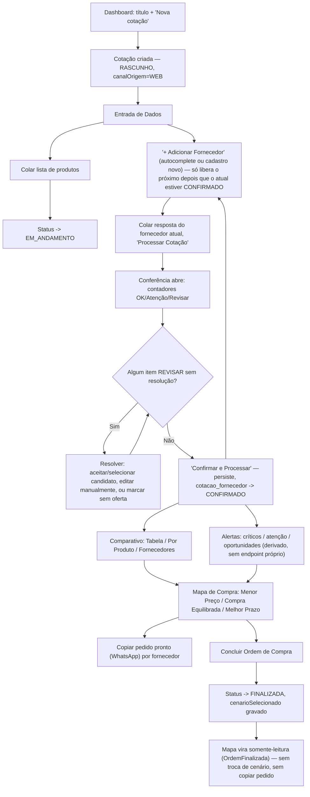
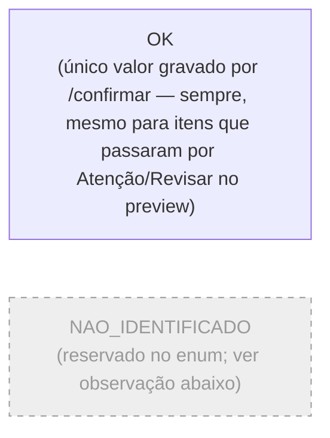

# Fluxograma 03 — Ciclo de Vida da Cotação

> Atualizado em 2026-07-17 após o refactor de fluxo sequencial + Conferência (ver
> `docs/PLAN REFACTOR.md` e Fluxograma 05).

## Máquina de estados (`CotacaoStatus`)

## Fluxo funcional ponta a ponta (o que o operador faz na tela)

Fornecedores dentro de uma cotação têm seu próprio estado sequencial
(`cotacao_fornecedor.status`): `PENDENTE` (adicionado, sem resposta processada) →
`PROCESSADO` (preview gerado, ainda não confirmado — reprocessar um fornecedor já
`CONFIRMADO` volta pra `PROCESSADO`) → `CONFIRMADO` (persistido). "+ Adicionar
Fornecedor" só habilita quando o último da lista está `CONFIRMADO` (gate
server-side em `CotacaoFornecedorService.adicionar`, 409 se violado).

## Itens dentro de uma cotação — status de cada oferta (`StatusItem`)

`DIVERGENCIA_PRECO`/`DIVERGENCIA_VOLUME` foram **removidos** do enum e da CHECK
constraint no refactor de 2026-07-16/17 (antes só "nunca atribuídos", agora não
existem mais). `PENDENTE_CONFIRMACAO` também saiu do enum — a suspeita de preço de
caixa/fardo virou o motivo `PACKAGE_PRICE_SUSPECTED` do preview (nunca um
`StatusItem` persistido). `NAO_IDENTIFICADO` permanece no enum mas
`ConfirmacaoRespostaService` sempre grava `OK`; as severidades ATENCAO/REVISAR e
seus motivos (`MotivoConferencia`) só existem no `PreviewRespostaResponse` — o que
sobrevive delas após confirmar é a lista de motivos em CSV no campo
`tipo_embalagem_detectado`, metadado informativo. Ver Fluxograma 05 para o pipeline
completo de classificação.

Todo item persistido entra no Mapa de Compra normalmente (status sempre `OK`); só
`semEstoque=true` exclui uma oferta do cálculo.
