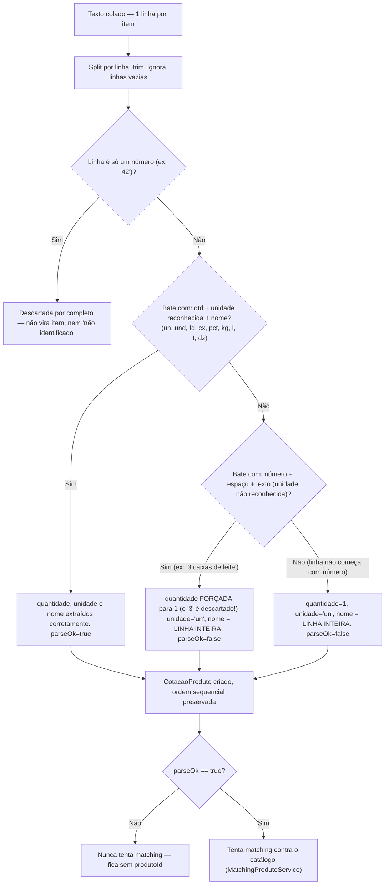
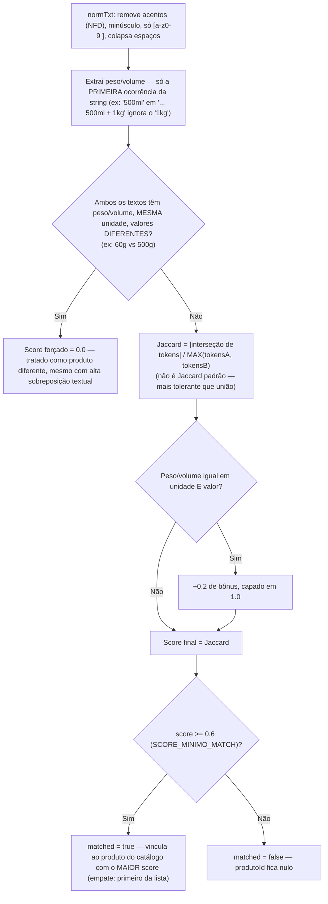

# Fluxograma 04 — Parsing da Lista de Produtos e Matching com o Catálogo

## Parser da lista colada pelo comprador (`ParserListaProdutosService`)

## Matching por similaridade (`MatchingProdutoService.calcSimilaridade`)

Se nenhum item do catálogo bater, `MatchingProdutoService` cria uma entrada nova em
`Produto` a partir do nome — o catálogo cresce organicamente; não existe
`POST /produtos` para criação manual direta.
