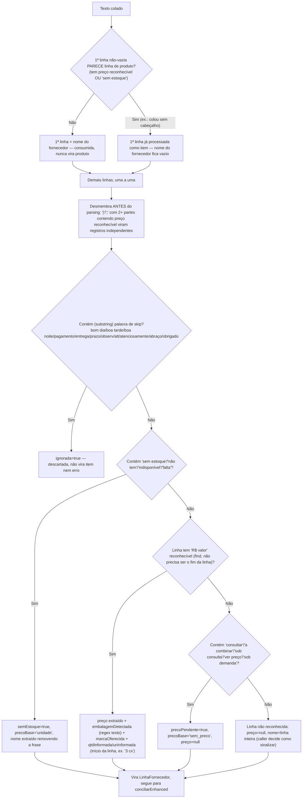
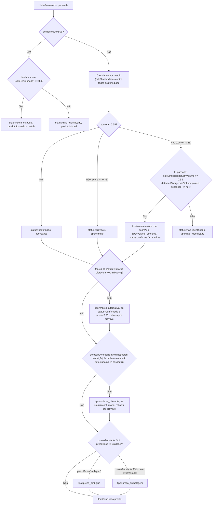
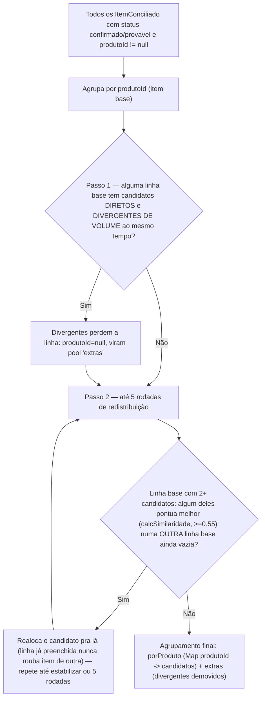
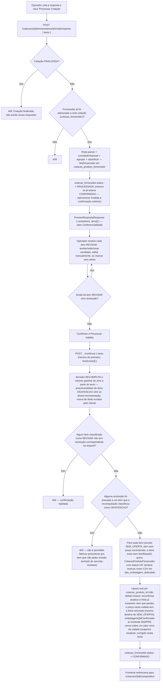
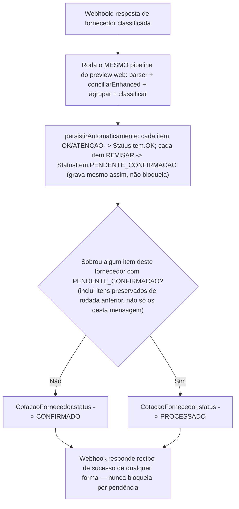
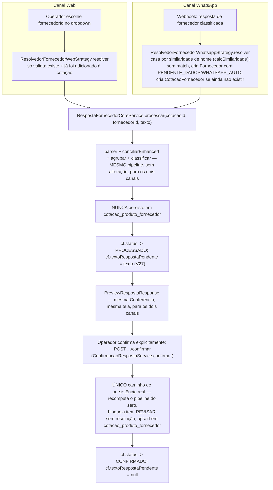

# Fluxograma 05 — Resposta de Fornecedor e Conferência

> Reescrito em 2026-07-17 após o refactor de fluxo sequencial + Conferência (ver
> `docs/PLAN REFACTOR.md`). O fluxo antigo (persistência direta no `POST .../resposta`,
> classificação só por score + palavra-chave de embalagem) não existe mais — nada
> grava em `cotacao_produto_fornecedor` antes de `POST .../confirmar`.
>
> Atualizado em 2026-07-29 (pacote de ajustes pós-call do cliente): item identificado
> sem preço deixou de gerar aviso (`PRICE_MISSING` removido, reverte 87228f3); opção
> não selecionada de `MULTIPLE_OPTIONS` ganhou ação explícita de Excluir/Adicionar como
> novo item (`ADICIONAR_CANDIDATO_A_LISTA`); `PACKAGE_PRICE_SUSPECTED` passou a também
> disparar para item COM preço quando ele é ≥1,5x a mediana dos demais fornecedores já
> confirmados nesta cotação OU quando a diferença absoluta é ≥R$10,00 (os dois
> critérios em OR, ajuste seguinte ao pacote original — antes só disparava para
> "consultar"/sem preço). `precoUnitarioCalculado` (não `precoInformado`) é o que
> entra na comparação — sem isso, corrigir a embalagem não fazia o alerta sumir do
> Comparativo (achado do cliente).
>
> Atualizado em 2026-08-04 (achado do usuário testando o fluxo WhatsApp manualmente):
> `WhatsappRespostaFornecedorService.processar` gravava `cotacao_fornecedor.status =
> CONFIRMADO` incondicionalmente, mesmo quando sobrava item `PENDENTE_CONFIRMACAO` —
> escondia a pendência tanto do gate de "+ Adicionar Fornecedor"
> (`CotacaoFornecedorService.adicionar`) quanto da ordenação "pendentes primeiro" da
> Entrada de Dados (`FornecedoresCotacoesSection.tsx`), que dependem desse status pra
> funcionar. Corrigido: agora só grava `CONFIRMADO` se **nenhum** item deste
> fornecedor ficou `PENDENTE_CONFIRMACAO`; caso contrário grava `PROCESSADO` — ver
> seção "Status do fornecedor via WhatsApp" abaixo. Na mesma leva, fechado o gap que
> essa correção expôs (a tela não tinha como reabrir a Conferência de um item
> pendente vindo do WhatsApp): botão "Conferir resposta do fornecedor" +
> `GET .../resposta-persistida` — ver "Como o operador resolve" logo abaixo da seção
> "AvisoService.resolver — dormente para o fluxo web".
>
> **Substituído em 2026-08-08 (Prompt 15 — unificação Web/WhatsApp do processamento de
> resposta de fornecedor):** a seção "Status do fornecedor via WhatsApp" abaixo, junto
> com o diagrama que descreve `persistirAutomaticamente`, descreve um mecanismo que
> **não existe mais**. A correção de 04/08 tratou só o sintoma (o valor gravado em
> `cotacao_fornecedor.status`); a causa raiz — o WhatsApp persistindo em
> `cotacao_produto_fornecedor` sem passar pela Conferência — continuava lá. Agora os
> dois canais compartilham o mesmo `RespostaFornecedorCoreService.processar`
> (channel-agnostic, sempre preview, nunca persiste) e a única persistência de fato
> continua sendo `POST .../confirmar`, para os dois canais, sem exceção — inclusive
> pra uma resposta WhatsApp sem nenhuma divergência, que agora também espera o
> operador confirmar pela Conferência antes de gravar. Isso também significa que o
> botão "Conferir resposta do fornecedor" deixou de depender de
> `GET .../resposta-persistida` reconstruir a partir de linhas já persistidas — o
> texto bruto pendente agora é gravado direto em
> `cotacao_fornecedor.texto_resposta_pendente` a cada preview (V27), disponível tanto
> antes quanto depois de qualquer persistência real. Ver a seção nova "Núcleo único de
> processamento (Web + WhatsApp)" ao final deste arquivo para o fluxo atual.

## Parser da resposta colada (`ParserRespostaFornecedorService`)

Atenção: o lado "catálogo" desse matching continua sendo a linha **inteira** que o
comprador colou originalmente (com sua própria quantidade/unidade), não o
`Produto.nome` limpo.

## Conciliação — `ConciliacaoRespostaService.conciliarEnhanced` (por linha)

## Agrupamento por item base — `ConciliacaoRespostaService.agrupar` (porte de `_srAgrupar`)

## Classificação OK/Atenção/Revisar — `ClassificacaoConferenciaService.classificar`

Porte fiel de `buildSupplierReview`/`_srCT` do protótipo 14/07. Roda **dentro do
preview** (`POST .../resposta`) e é **recomputada do zero** dentro de
`POST .../confirmar` a partir do mesmo `texto` reenviado — não existe estado de
rascunho persistido entre as duas chamadas.

```mermaid
flowchart TD
    A["Para cada item base da cotação, olha os candidatos agrupados (porProduto)"] --> B{"Nenhum candidato (ms vazio)?"}
    B -->|"Sim"| B1["NÃO gera linha na Conferência — item some da tela, não bloqueia confirmação"]
    B -->|"Não"| C{"Mais de 1 candidato?"}
    C -->|"Sim"| C1["status=REVISAR, motivo=MULTIPLE_OPTIONS, candidatos=todos (radio no modal). Cada opção NÃO selecionada ganha ação explícita: Excluir (já era o descarte padrão) ou Adicionar como novo item na lista base (ADICIONAR_CANDIDATO_A_LISTA, texto/preço editáveis)"]
    C -->|"Não (exatamente 1)"| D["Cascata sobre o candidato único — cada regra pode ACRESCENTAR motivo, nunca remove um já setado"]
    D --> D1{"extrairMarca(base) != extrairMarca(oferta)?"}
    D1 -->|"Sim"| D1a["+BRAND_CHANGED, escala pra ATENCAO"]
    D1 -->|"Não"| D2
    D1a --> D2{"Mesma dimensão (peso/volume) nos dois E valorBase diverge (>0.001)?"}
    D2 -->|"Sim"| D2a["+WEIGHT_CHANGED, escala pra REVISAR"]
    D2 -->|"Não"| D3{"Base SEM medida, oferta COM medida?"}
    D2a --> D4
    D3 -->|"Sim"| D3a["+WEIGHT_ADDED ou +VOLUME_ADDED (dimensão da oferta), escala pra REVISAR"]
    D3 -->|"Não"| D4
    D3a --> D4{"Embalagem (detectarEmbalagemPorTexto): base sem qtd interna, oferta com?"}
    D4 -->|"Sim"| D4a["+PACKAGE_QTY_ADDED, escala pra REVISAR"]
    D4 -->|"Não"| D5{"Ambos com qtd interna, mas divergem?"}
    D4a --> D6
    D5 -->|"Sim"| D5a["+PACKAGE_QTY_CHANGED, escala pra REVISAR"]
    D5 -->|"Não"| D6{"precoPendente OU precoBase suspeito (não unidade/sem_preco) OU preço >= 1.5x a referência OU preço - referência >= R$10 (mediana dos demais fornecedores já confirmados nesta cotação, via PrecoReferenciaService)?"}
    D5a --> D6b
    D6 -->|"Sim"| D6a["+PACKAGE_PRICE_SUSPECTED, escala pra REVISAR"]
    D6 -->|"Não"| D6b{"confianca < 0.45 E status da conciliação = provavel?"}
    D6a --> D6b
    D6b -->|"Sim"| D6c["+LOW_CONFIDENCE_MATCH, escala pra ATENCAO (só rebaixa se ainda OK)"]
    D6b -->|"Não"| D7{"divergenciaVolume detectado na conciliação?"}
    D6c --> D7
    D7 -->|"Sim"| D7a["reforça WEIGHT_CHANGED (se ainda não presente), escala pra REVISAR"]
    D7 -->|"Não"| D8{"tipoCorrespondencia = marca_alternativa?"}
    D7a --> D8
    D8 -->|"Sim"| D8a["reforça BRAND_CHANGED (se ainda não presente), escala pra ATENCAO"]
    D8 -->|"Não"| E["ItemConferencia final: status + motivos acumulados + candidato único"]
    D8a --> E
```

`escalar()` nunca rebaixa: `REVISAR > ATENCAO > OK` — uma vez atingido REVISAR, a
severidade do item não desce mais dentro da mesma classificação.

Depois de percorrer todos os itens base, dois grupos adicionais viram linhas com
`itemBaseId=null` ("item extra", não persistível):
- os candidatos demovidos no Passo 1 do agrupamento (divergentes de volume que
  perderam a linha para um match direto);
- linhas "não identificadas" da conciliação que têm preço reconhecido (produto novo,
  fora da lista base, mas o fornecedor cobrou por ele).

## Preview → Conferência → Confirmação (ciclo completo por fornecedor)

Regras de resolução por `TipoResolucao` (`ConfirmacaoRespostaService`):
- `ACEITAR_SUGESTAO` — só válido se o item tinha exatamente 1 candidato; preço vem do
  candidato recomputado.
- `SELECIONAR_CANDIDATO` — exige que `textoOriginalSelecionado` bata com um dos
  candidatos recomputados (`MULTIPLE_OPTIONS`); preço vem desse candidato, nunca de
  override do cliente.
- `EDITAR_MANUAL` — único caminho que aceita preço arbitrário do cliente; exige texto
  e preço não vazios.
- `SEM_OFERTA` — item simplesmente não é persistido para este fornecedor.
- `ADICIONAR_CANDIDATO_A_LISTA` — só válido para um candidato dentro de um item
  `MULTIPLE_OPTIONS` genuíno da rodada atual; cria um `CotacaoProduto` novo a partir do
  candidato (texto/preço editáveis pelo operador, obrigatórios e validados `> 0`), sem
  tocar no item original. Exige `itemBaseId` (item de origem) + `textoOriginalExtra`
  (candidato específico) ao mesmo tempo — única exceção à regra geral de "exatamente um
  dos dois".
- Item com preço não extraível do texto (`precoPendente`, "consultar"/"a combinar") e
  sem resolução manual correspondente → 400 pedindo edição manual — nunca grava
  `preco_informado` nulo.
- Item identificado sem preço reconhecível, mas que **não** é `precoPendente` (não é o
  caso "consultar/a combinar" acima) → não gera erro nem pede resolução: é estado
  normal ("fornecedor não informou preço para este item"), tratado como se o item não
  tivesse sido mencionado — nenhuma linha é gravada, e uma linha já confirmada em
  rodada anterior é removida (reverte a decisão do commit 87228f3, "sem preço vai para
  Revisar").

## Status persistido — `StatusItem` (decisão E do plano)

`CotacaoProdutoFornecedor.status` gravado pelo `/confirmar` é **sempre `OK`**. As
severidades ATENCAO/REVISAR do preview são efêmeras (existem só no
`PreviewRespostaResponse`, nunca persistidas) — o que sobrevive delas é a lista de
`MotivoConferencia` gravada como CSV em `tipo_embalagem_detectado`, metadado
informativo, não um `StatusItem` à parte. `DIVERGENCIA_PRECO`/`DIVERGENCIA_VOLUME`
foram **removidos** do enum e da CHECK constraint (não é mais "existe mas nunca
atribuído" — não existe mais).

## `AvisoService.resolver` — dormente para o fluxo web

Endpoint `POST /cotacoes/{id}/avisos/{cpfId}/resolver` e o service continuam
existindo (preservados para um futuro canal que persista direto, ex. WhatsApp, fora
de escopo — decisão H do plano), mas **nenhum componente do frontend o chama mais**:
como `/confirmar` já resolve preço/embalagem/marca no mesmo passo e sempre grava
`status=OK`, o gatilho antigo (`status=PENDENTE_CONFIRMACAO`) nunca é produzido pelo
fluxo web atual. Só testável via chamada direta à API.

Esse "futuro canal" da decisão H chegou na Fase 3 (`WhatsappRespostaFornecedorService`)
e agora É quem produz `PENDENTE_CONFIRMACAO` — mas `AvisoService.resolver` continua tão
dormente quanto antes (nenhum componente novo passou a chamá-lo). Ver seção seguinte
para o que de fato acontece com um item pendente vindo do WhatsApp.

## Status do fornecedor via WhatsApp (`WhatsappRespostaFornecedorService`) — SUPERSEDIDO em 08/08

> Esta seção descreve o comportamento ANTES do Prompt 15 (unificação Web/WhatsApp,
> 2026-08-08) — mantida por valor histórico/arqueológico, não reflete o código atual.
> Ver "Núcleo único de processamento (Web + WhatsApp)" ao final deste arquivo para o
> fluxo vigente. Resumo da mudança: `persistirAutomaticamente` foi eliminado —
> `WhatsappRespostaFornecedorService.processar` nunca mais persiste em
> `cotacao_produto_fornecedor` nem grava `CotacaoFornecedor.status = CONFIRMADO`
> sozinho; delega 100% do processamento pro mesmo núcleo do canal Web
> (`RespostaFornecedorCoreService`), que sempre só gera preview.

Diferente do `/confirmar` do fluxo web (sempre grava `StatusItem.OK`, seção anterior),
uma resposta de fornecedor recebida por WhatsApp não tem operador humano no loop pra
resolver um item `REVISAR` na hora — o webhook não pode bloquear esperando decisão.
`WhatsappRespostaFornecedorService.processar` grava esses itens mesmo assim, com
`StatusItem.PENDENTE_CONFIRMACAO`, e o `CotacaoFornecedor.status` resultante reflete
se sobrou pendência:

Corrigido em 2026-08-04 (ver nota no topo do arquivo) — antes gravava sempre
`CONFIRMADO`, incondicional. Isso importa porque dois mecanismos do fluxo web já
dependiam de `CotacaoFornecedor.status` e ficavam inertes com o valor sempre forçado
pra `CONFIRMADO`:

- **Gate de "+ Adicionar Fornecedor"** (`CotacaoFornecedorService.adicionar`, regra
  1.1): só libera adicionar o próximo fornecedor depois que o último `status ==
  CONFIRMADO`. Com o bug, uma cotação WhatsApp com item pendente deixava adicionar
  fornecedor novo pelo painel mesmo sem nada revisado.
- **Ordenação "pendentes primeiro"** da Entrada de Dados
  (`FornecedoresCotacoesSection.tsx`, `sequencia`/`totalPendentes`): já filtra e ordena
  por `cf.status !== "CONFIRMADO"`, e mostra "N para conferir" — mas com tudo sempre
  `CONFIRMADO`, o item pendente nunca aparecia nesse agrupamento, só como um badge
  "Confirmação pendente" sem ação (`TabelaComparativa.tsx`) no Comparativo.

**Como o operador resolve** (fechado em 2026-08-04, mesma leva do achado acima):
botão **"Conferir resposta do fornecedor (N)"** ao lado de "+ Adicionar Fornecedor"
em `FornecedoresCotacoesSection.tsx`, visível sempre que `totalPendentes > 0`. Ao
clicar, chama `GET /cotacoes/{id}/fornecedores/{fornId}/resposta-persistida`
(`FornecedorRespostaService#textoPersistido`, novo) — junta o `texto_original` já
gravado em cada `CotacaoProdutoFornecedor` deste fornecedor (ordenado pela ordem da
lista base) — e alimenta esse texto de volta no MESMO `POST .../resposta` que o
fluxo web usa, reabrindo a Conferência normalmente. Importante: um preview gerado a
partir de texto VAZIO não funcionaria aqui — `mesclarComConfirmacoesAnteriores`
marca todo item "preservado" (não tocado nesta rodada) como `StatusConferencia.OK`
incondicionalmente, então o item pendente teria que estar mencionado no texto de
novo pra ser reclassificado como REVISAR e aparecer resolvível no modal; daí
reconstruir o texto real, não só disparar um preview em branco.

## Núcleo único de processamento (Web + WhatsApp) — Prompt 15, 2026-08-08

Substitui a seção anterior ("Status do fornecedor via WhatsApp"). A Conferência é o
único gate de qualidade do sistema (seção "Preview → Conferência → Confirmação" acima)
— até 08/08 isso só era verdade de fato para o canal Web; o WhatsApp persistia direto,
por trás da Conferência. Unificado: os dois canais agora compartilham o mesmo núcleo, e
a única diferença legítima entre eles é COMO o fornecedor é resolvido.

Pontos que mudam de comportamento observável em relação à seção anterior (superseded):

- Uma resposta WhatsApp **sem nenhuma divergência** não confirma mais sozinha — fica
  `PROCESSADO` esperando o operador abrir a Conferência e clicar "Confirmar e
  Processar" pelo menos uma vez, mesmo que não haja nada pra resolver (decisão
  deliberada: confirmação sempre explícita, sem exceção pro caso trivial).
- `StatusItem.PENDENTE_CONFIRMACAO` deixa de ser gravado por qualquer caminho de
  produção — todo item persistido via `/confirmar` é sempre `StatusItem.OK` (mesma
  regra que já valia pro Web). O valor continua existindo no enum/schema (fixtures de
  teste que provam a exclusão defensiva desse status em `MapaCompraService` continuam
  usando-o).
- `GET .../resposta-persistida` (`FornecedorRespostaService#textoPersistido`) não
  depende mais de reconstruir a partir de linhas já persistidas — o texto bruto
  pendente agora é gravado direto em `cotacao_fornecedor.texto_resposta_pendente` a
  cada preview (`RespostaFornecedorCoreService.processar`, V27), disponível mesmo
  quando nada foi confirmado ainda. A reconstrução a partir de
  `cotacao_produto_fornecedor` vira fallback (cobre respostas confirmadas antes desta
  migration).
- A trava de edição pós-conferência (seção 3.5 da doc técnica,
  `CotacaoProdutoItemService.editar`) passa a disparar no MESMO momento pros dois
  canais (após confirmação explícita), em vez de quase instantaneamente pro WhatsApp.
