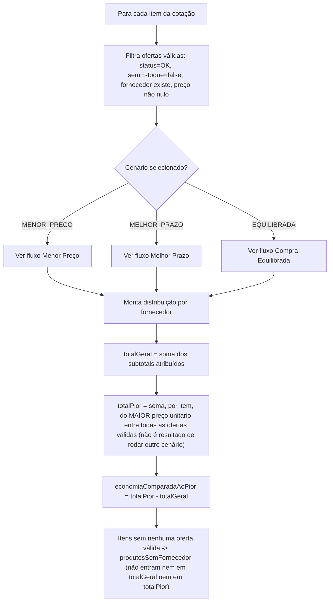
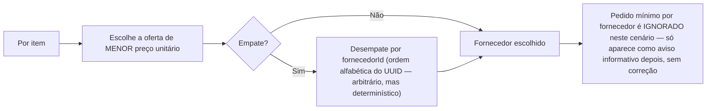
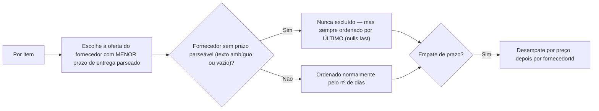
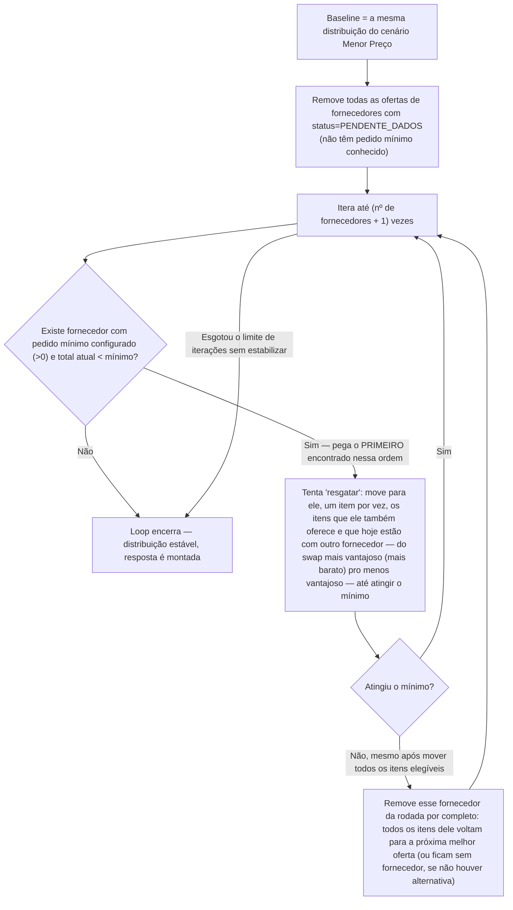
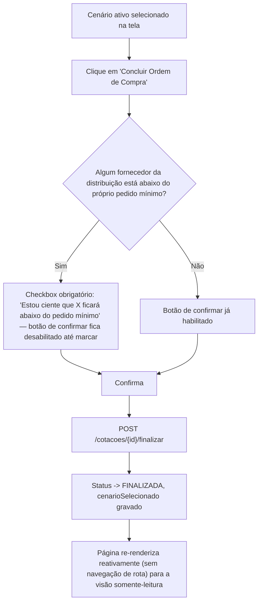

# Fluxograma 06 — Mapa de Compra (3 Cenários)

## Preparação comum aos 3 cenários

## Cenário: Menor Preço

## Cenário: Melhor Prazo

## Cenário: Compra Equilibrada (heurística gulosa — não é ótimo global)

Se o limite de iterações (`fornecedores.size() + 1`) for esgotado sem o algoritmo
estabilizar, a distribuição parcial daquele momento é retornada como final — sem
nenhum sinal explícito de "não convergiu" na resposta.

## Fluxo de finalização a partir do Mapa

