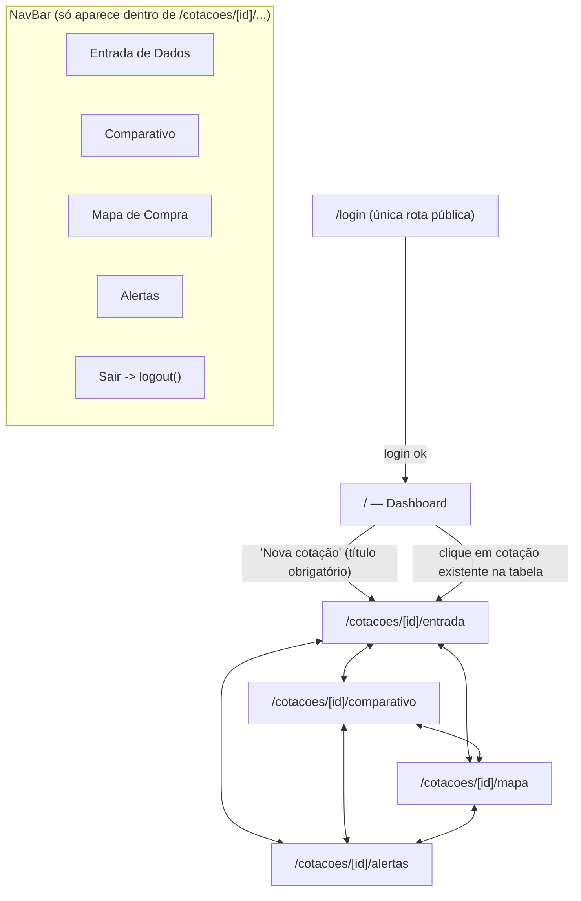
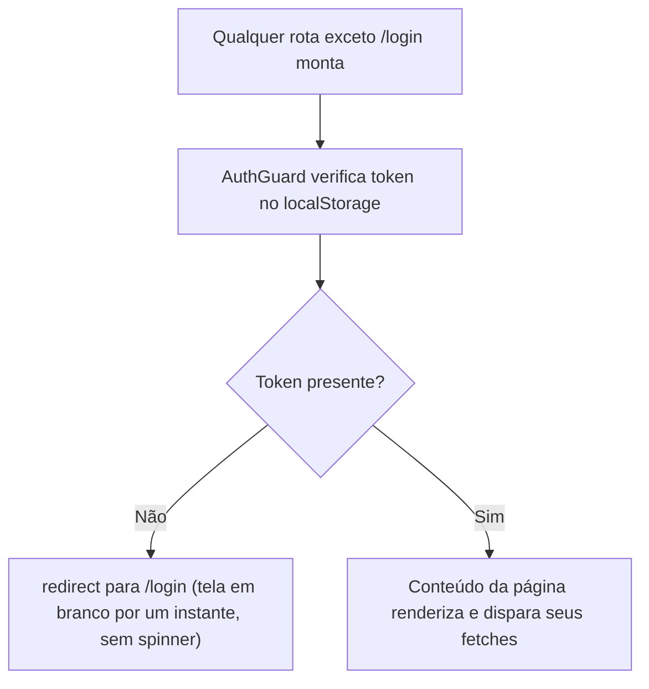
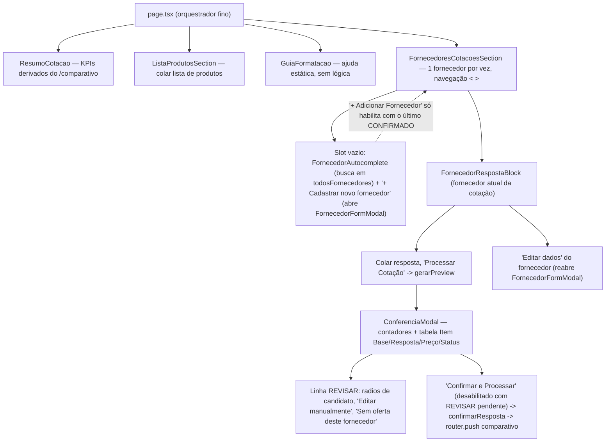
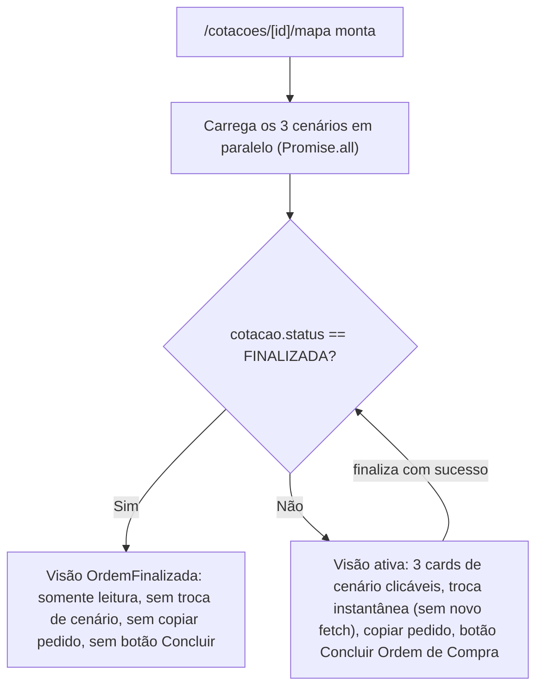

# Fluxograma 07 — Navegação do Frontend

## Mapa de rotas

Não existe painel administrativo — nenhuma rota `/admin/*` no frontend.

## Guarda de autenticação em cada rota

## Dentro da Entrada de Dados — composição de componentes

> Reescrito em 2026-07-17 — a antiga `FornecedoresSidebar` com abas simultâneas e
> `FornecedorRespostaBlock` com resolução de aviso inline deram lugar ao fluxo
> sequencial com gate + `ConferenciaModal` (ver Fluxograma 05).

## Estado da tela de Mapa de Compra conforme o status da cotação

