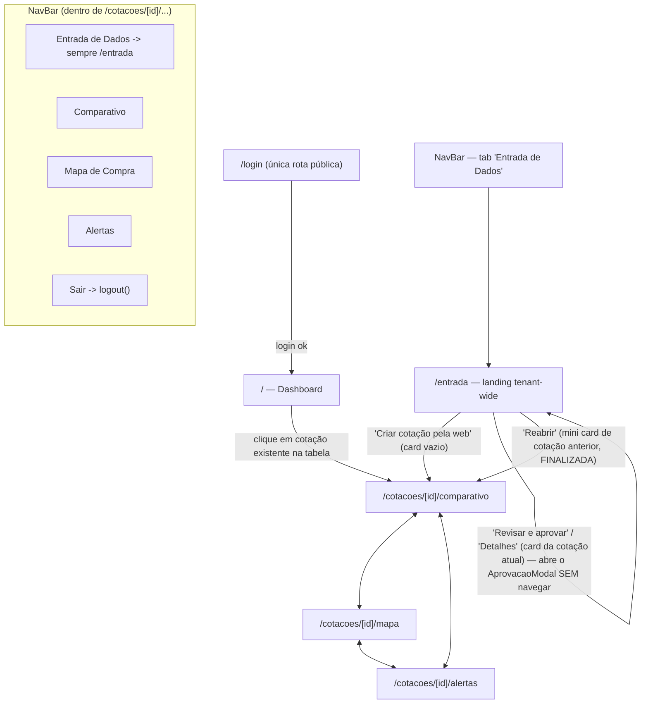
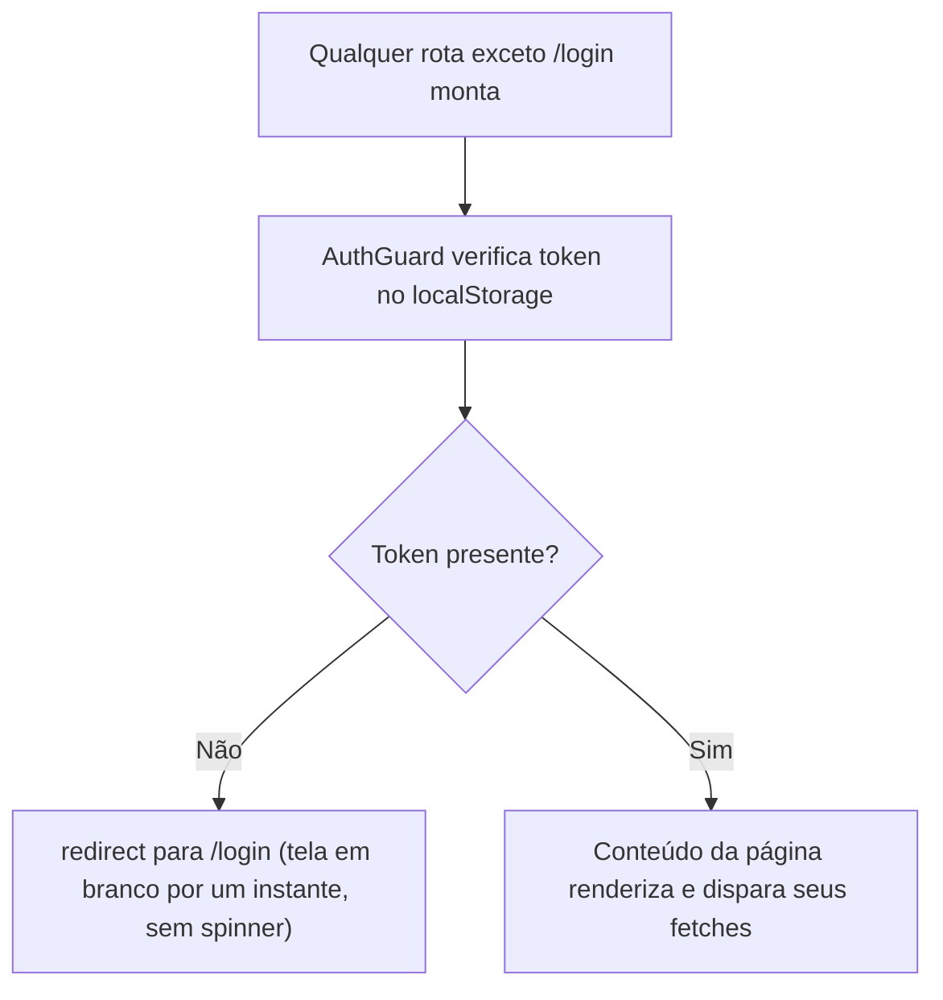
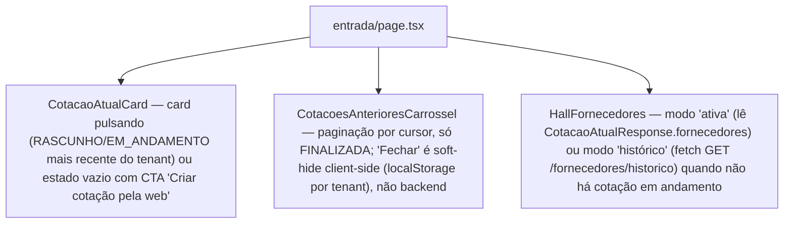
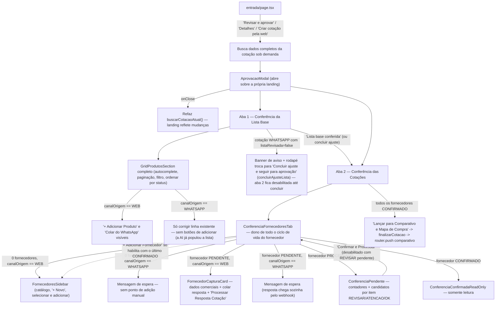
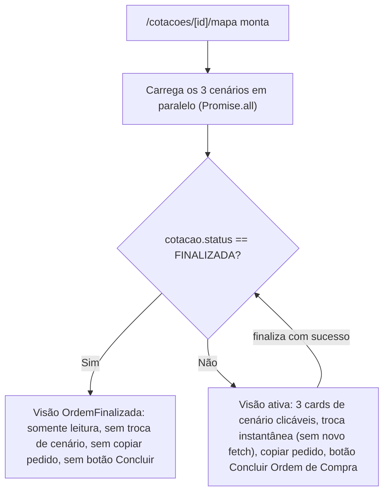

# Fluxograma 07 — Navegação do Frontend

## Mapa de rotas

> Atualizado em 2026-08-20 (refactor Entrada de Dados, leva final) — a rota separada
> `/cotacoes/[id]/entrada` **deixou de existir**. A antiga tab fixa "Entrada de Dados"
> do NavBar (que ou navegava pra lá ou abria um modal de criação, dependendo de haver
> cotação ativa) virou uma landing tenant-wide própria, `/entrada`, e o
> `AprovacaoModal` (produto + fornecedores + conferência) passou a ser hospedado
> **direto nela** — a pedido explícito do usuário ("a tela de fundo do modal deve ser
> a tela Entrada de Dados Cotação atual"). "Revisar e aprovar"/"Detalhes" não navegam
> mais pra lugar nenhum: buscam os dados completos da cotação sob demanda e abrem o
> modal por cima da própria landing, que continua visível atrás dele. O botão fixo
> "+ Nova Cotação" também foi removido — criar cotação passou a ser só pelo CTA do
> card vazio de `/entrada`.

`ADMIN_PRX` tem um painel próprio sob `/admin/*` (`/admin/tenants`, `/admin/tenants/[id]`,
`/admin/administradores`) — fora do escopo deste fluxograma, focado no fluxo de negócio
do tenant (`OPERADOR_CLIENTE`).

## Guarda de autenticação em cada rota

## Landing tenant-wide (`/entrada`) — composição de componentes

> Nova em 2026-08-20 (Fase B do refactor da Entrada de Dados). Substitui o antigo
> ponto de entrada fixo do NavBar. Na leva final do mesmo refactor (mesmo dia), passou
> também a hospedar o `AprovacaoModal` diretamente — ver seção seguinte.

## `AprovacaoModal`, hospedado na própria landing — composição de componentes

> Reescrito em 2026-08-20 (múltiplas levas do refactor da Entrada de Dados, a pedido
> explícito do usuário): "o fluxo agora deve ser centralizado no novo modal; a aba do
> fundo deve ser excluída" → "o fluxo Web deve usar o mesmo modal do WhatsApp, até
> mesmo na etapa de produto" → "a tela de fundo do modal deve ser a tela Entrada de
> Dados Cotação atual". O resultado final: **não existe mais a rota
> `/cotacoes/[id]/entrada`**. `CotacaoAtualCard` ("Revisar e aprovar"/"Detalhes") e o
> CTA "Criar cotação pela web" não navegam — buscam os dados completos da cotação
> (`buscarCotacao`+`listarFornecedores`+`listarFornecedoresDaCotacao`+`buscarLista`+
> catálogo) sob demanda e abrem o `AprovacaoModal` direto sobre a própria landing
> (`entrada/page.tsx`), que continua visível (card + carrossel + Hall) atrás dele.
> Fechar o modal refaz a busca de `buscarCotacaoAtual()` pra landing refletir qualquer
> mudança (itens, fornecedores, status). Web e WhatsApp usam exatamente o mesmo modal,
> inclusive na etapa de produto — a diferença entre os dois canais é só quais botões/
> campos de **captura** aparecem, nunca a estrutura de revisão.

## Estado da tela de Mapa de Compra conforme o status da cotação

